# Исследование задачи о многоруком бандите

## Цель работы

Целью лабораторной работы является исследование задачи о многоруком бандите и экспериментальное сравнение различных стратегий выбора действий в условиях неопределённости.

В рамках работы необходимо реализовать и исследовать четыре алгоритма выбора действий:

- жадную стратегию (Greedy);
- эпсилон-жадный алгоритм (Epsilon-Greedy);
- алгоритм с верхней доверительной границей (Upper Confidence Bound, UCB);
- алгоритм на основе стохастического градиентного подъёма с использованием распределения Softmax (Gradient).

В ходе исследования необходимо определить влияние параметров алгоритмов на качество обучения, а также исследовать изменение эффективности алгоритмов при увеличении количества доступных действий.

В качестве основной характеристики эффективности используется средняя награда, получаемая агентом в процессе взаимодействия со средой. Дополнительно используется доля выбора оптимального действия.

## Математическая модель многорукого бандита

Задача многорукого бандита представляет собой модель принятия решений, в которой агент на каждом шаге выбирает одно из нескольких доступных действий, после чего получает случайное вознаграждение.

В рамках данной работы каждое действие соответствует отдельному рычагу игрового автомата.

Для каждого рычага $i$ задаются:

- вероятность получения выигрыша $p_i$,
- величина вознаграждения $r_i$.

Если выигрыш не выпадает, агент получает нулевую награду. Таким образом, математическое ожидание награды для рычага определяется выражением:

$$ q_i = p_i r_i. $$

Оптимальным считается действие, имеющее максимальное ожидаемое вознаграждение:

$$ a^∗=argimax(q_i) $$

В базовом варианте эксперимента используются три рычага:

| Рычаг | Вероятность выигрыша | Награда при выигрыше | Ожидаемая награда |
| ----: | -------------------: | -------------------: |------------------:|
|     0 |                 0.10 |                    4 |              0.40 |
|     1 |                 0.15 |                    3 |              0.45 |
|     2 |                 0.30 |                    1 |              0.30 |

Следовательно, оптимальным является рычаг 1, поскольку его ожидаемая награда равна 0.45.

При этом агент заранее не получает информацию о значениях $p_i$ и $r_i$. Он должен самостоятельно оценивать качество действий на основе получаемых наград.

Таким образом, основная проблема заключается в необходимости найти баланс между двумя типами поведения:

- исследованием - выбором недостаточно изученных действий;
- использованием найденной информации - выбором действия с наилучшей текущей оценкой.

## Используемые алгоритмы

### Жадная стратегия

Жадная стратегия на каждом шаге выбирает действие с максимальной текущей оценкой средней награды.

Для действия $a$ оценка определяется как средняя полученная награда:
$$
Q(a) = \frac{1}{N(a)} \sum_{t=1}^{N(a)} R_t,
$$

где:
- $N(a)$ - количество выборов действия $a$;
- $R_t$ - полученная при этом награда.

На каждом шаге выбирается:
$$
A_t = argmax(Q(a))
$$

В начале работы каждое действие выбирается хотя бы один раз, чтобы получить его первоначальную оценку.

Основной недостаток жадной стратегии заключается в отсутствии механизма исследования. Если из-за случайности на ранних этапах неоптимальное действие получит более высокую оценку, алгоритм может продолжить выбирать его в дальнейшем и практически не исследовать остальные действия.

### Epsilon-жадный алгоритм

Эпсилон-жадный алгоритм добавляет к жадной стратегии механизм случайного исследования.

С вероятностью $\varepsilon$ выбирается случайное действие, а с вероятностью $1-\varepsilon$ - действие с максимальной текущей оценкой:
$$
A = \begin{cases}
\text{случайное действие,}& \text{ с вероятностью ε} \\
argmax(Q(a)) & \text{с вероятностью 1 - ε}
\end{cases}
$$

Параметр $\varepsilon$ определяет интенсивность исследования среды.

При малом значении $\varepsilon$ алгоритм преимущественно использует уже найденное решение. При увеличении $\varepsilon$ возрастает количество случайных исследований, однако одновременно увеличивается число выборов неоптимальных действий.

В работе исследовались следующие значения:
$$
ε \in \{0.01,0.05,0.1,0.2,0.5\}.
$$

### Алгоритм верхней доверительной границы (UCB)

Алгоритм верхней доверительной границы учитывает не только текущую оценку награды, но и степень неопределённости этой оценки

Для выбора действия используется значение:
$$
UCB(a) = Q(a) + c\sqrt{\frac{ln(t)}{N(a)}}
$$

где:
$Q(a)$ - текущая оценка средней награды действия;
$t$ - общее количество выполненных действий;
$N(a)$ - количество выборов действия;
$c$ - параметр, определяющий интенсивность исследования.

Первое слагаемое отвечает за использование уже полученной информации, а второе - за исследование действий, которые выбирались недостаточно часто.

В работе исследовались следующие значения:
$$
c \in \{0.1,0.5,1.0,2.0,5.0\}.
$$

### Алгоритм на основе стохастического градиентного подъема с учетом оценки вероятности по распределению softmax

В алгоритме вместо непосредственной оценки ожидаемой награды каждого действия используются предпочтения действий $H(a)$.

На их основе с помощью функции Softmax рассчитывается вероятность выбора каждого действия:
$$
\pi(a) = \frac{e^{H(a)}}{\sum_b e^{H(b)}}
$$

Таким образом, действие с большим значением предпочтения получает большую вероятность выбора, однако остальные действия также могут быть выбраны.

После получения награды предпочтения корректируются методом стохастического градиентного подъёма.

В качестве базового уровня используется средняя полученная награда:
$$
R_t^* = R_{t-1}^* + \frac{1}{t}(R_t - R_{t-1}^*)
$$

Обновление предпочтения выбранного действия выполняется с учётом разности между полученной наградой и средней наградой среды.

Параметр $\alpha$ определяет скорость изменения предпочтений.

В работе исследовались значения:
$$
\alpha \in \{0.01,0.05,0.1,0.5,1.0\}
$$

## Программная реализация

### Среда эксперимента

Для проведения экспериментов была реализована собственная среда `BanditEnv`.

Среда хранит количество рычагов, вероятность получения выигрыша и величину награды для каждого действия.

Основной метод среды - `step(action)`. Он принимает выбранное действие и генерирует случайный результат с использованием заданной вероятности выигрыша.

```python
class BanditEnv:
    def __init__(self, payout_list, reward_list):
        if len(payout_list) != len(reward_list):
            raise ValueError(
                "Количество вероятностей и наград должно совпадать"
            )

        self.payout_list = payout_list
        self.reward_list = reward_list
        self.n_actions = len(payout_list)

    def step(self, action):
        if not 0 <= action < self.n_actions:
            raise ValueError(
                f"Некорректное действие: {action}"
            )

        if torch.rand(1).item() < self.payout_list[action]:
            return self.reward_list[action]

        return 0
```

Дополнительно в среде реализованы свойства для определения ожидаемых наград и оптимального действия:

```python
@property
def expected_rewards(self):
    return [
        p * r
        for p, r in zip(self.payout_list, self.reward_list)
    ]

@property
def optimal_action(self):
    return max(
        range(self.n_actions),
        key=lambda action: self.expected_rewards[action]
    )
```

### Общий интерфейс алгоритмов

Для унификации работы различных стратегий был введён базовый интерфейс:
```python
class BanditAlgorithm:
    def select_action(self):
        raise NotImplementedError

    def update(self, action, reward):
        raise NotImplementedError
```

Каждый алгоритм реализует два основных действия:

1. `select_action()` - выбор следующего действия;
2. `update()` - обновление внутренних параметров алгоритма после получения награды.

Такое разделение позволяет использовать один и тот же экспериментальный код для всех исследуемых алгоритмов.

### Проведение одного эксперимента

Один эксперимент состоит из заданного количества эпизодов.

На каждом эпизоде:

- алгоритм выбирает действие;
- среда возвращает награду;
- алгоритм обновляет своё состояние;
- сохраняются выбранное действие и полученная награда.

После завершения эксперимента рассчитываются средняя накопленная награда и доля выбора оптимального действия.

```python
def run_experiment(env, algorithm, n_episodes):
    rewards = []
    actions = []

    for episode in range(n_episodes):
        action = algorithm.select_action()
        reward = env.step(action)

        algorithm.update(
            action,
            reward
        )

        actions.append(action)
        rewards.append(reward)

    average_rewards = calculate_average_reward(rewards)

    optimal_action_rate = calculate_optimal_action_rate(
        actions,
        env.optimal_action
    )

    return {
        "actions": actions,
        "rewards": rewards,
        "average_rewards": average_rewards,
        "optimal_action_rate": optimal_action_rate
    }
```

### Усреднение результатов

Поскольку результат одного запуска зависит от случайных наград, для повышения устойчивости оценки каждый эксперимент выполнялся несколько раз.

Для каждого запуска создавался новый экземпляр алгоритма, после чего результаты усреднялись по всем запускам.

```python
def run_multiple_experiments(
    env,
    algorithm_factory,
    n_episodes,
    n_runs
):
    all_average_rewards = []
    all_optimal_action_rates = []

    for run in range(n_runs):
        algorithm = algorithm_factory()

        result = run_experiment(
            env=env,
            algorithm=algorithm,
            n_episodes=n_episodes
        )

        all_average_rewards.append(
            result["average_rewards"]
        )

        all_optimal_action_rates.append(
            result["optimal_action_rate"]
        )

    average_rewards = torch.tensor(
        all_average_rewards
    ).mean(dim=0)

    optimal_action_rates = torch.tensor(
        all_optimal_action_rates
    ).mean(dim=0)

    return {
        "average_rewards": average_rewards.tolist(),
        "optimal_action_rate": optimal_action_rates.tolist()
    }
```
Во всех основных экспериментах использовалось 10 000 эпизодов и 100 независимых запусков, за исключением эксперимента по количеству рычагов, для которого использовалось 100 запусков в финальном прогоне, судя по твоему последнему логу.

## Метрики исследования

В работе используются две основные метрики.

### Средняя награда

Для каждого момента времени вычисляется накопленная средняя награда:

$$ \bar R_t = \frac{1}{t} \sum_{i=1}^{t} R_i. $$

Данная метрика является основной, поскольку непосредственно показывает качество выбранной стратегии с точки зрения получаемого вознаграждения.

### Доля выбора оптимального действия

Дополнительно рассчитывается доля эпизодов, в которых алгоритм выбрал оптимальный рычаг:

$$ P_t = \frac{N_{\text{optimal}}(t)} {t}, $$

где $N_{\text{optimal}}(t)$ - количество выборов оптимального действия за первые $t$ эпизодов.

Эта метрика позволяет оценить, насколько хорошо алгоритм обнаруживает оптимальное действие и насколько устойчиво его использует.

## Экспериментальное исследование

### Сравнение алгоритмов

Для первоначального сравнения исследуемых алгоритмов был проведён эксперимент на среде с тремя рычагами. Для каждого алгоритма использовалось 10 000 эпизодов, а для уменьшения влияния случайности результаты усреднялись по 100 независимым запускам.

В базовом эксперименте использовались следующие параметры алгоритмов:

- для Epsilon-Greedy - $\varepsilon = 0.5$;
- для UCB - $c = 1.0$;
- для Gradient - $\alpha = 0.1$.

Жадный алгоритм параметров, связанных с исследованием, не имеет.

Результаты эксперимента представлены в таблице 1.

#### Таблица 1 - Результаты сравнения алгоритмов
| Алгоритм        | Средняя награда | Доля выбора оптимального действия |
| --------------- | --------------: | --------------------------------: |
| Greedy          |          0.3817 |                            0.1300 |
| Epsilon-Greedy  |          0.4114 |                            0.5869 |
| UCB             |          0.4369 |                            0.8288 |
| Gradient |          0.4379 |                            0.8218 |

Для наглядного сравнения алгоритмов была построена зависимость средней награды от номера эпизода.

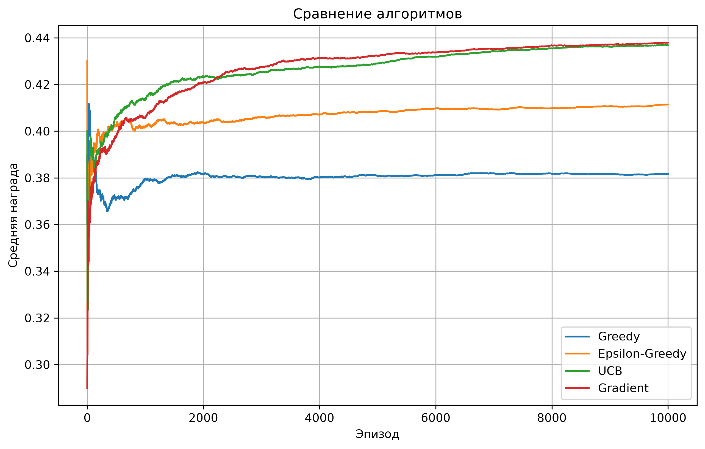
#### Рисунок 1 - Изменение средней награды для различных алгоритмов
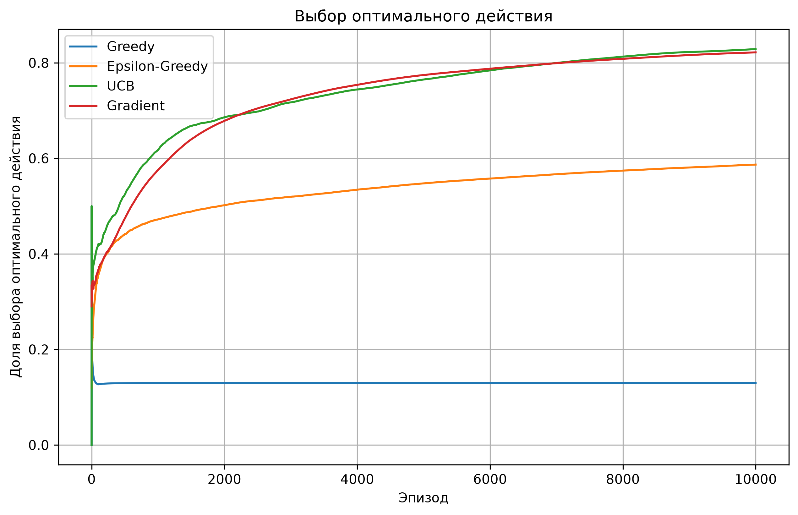
#### Рисунок 1 - Изменение верятности выбора оптимального решения для различных алгоритмов

Полученные результаты демонстрируют существенное влияние механизма исследования среды на эффективность алгоритмов.

Жадная стратегия показала среднюю награду 0.3817, что заметно ниже результатов остальных алгоритмов. 
Доля выбора оптимального действия составила всего 13%. 
Такое поведение связано с особенностью жадного подхода:после первоначального исследования алгоритм преимущественно выбирает действие с наилучшей текущей оценкой и не имеет специального механизма для дополнительного исследования альтернативных действий.
Поэтому случайно высокая награда неоптимального рычага на ранних этапах может привести к его длительному выбору.

Добавление случайного исследования в Epsilon-Greedy позволило увеличить среднюю награду до 0.4114, а долю выбора оптимального действия - до 58.69%. 
По сравнению с жадной стратегией это показывает положительное влияние механизма исследования. 
При этом значение $\varepsilon=0.5$ означает достаточно интенсивное исследование: в среднем примерно половина действий выбирается случайным образом. 
П оэтому часть потенциальной награды теряется из-за выбора неоптимальных действий.

Алгоритм UCB показал среднюю награду 0.4369, а оптимальное действие выбиралось в 82.88% случаев. 
Более высокий результат по сравнению с Epsilon-Greedy объясняется тем, что UCB учитывает не только оценку средней награды, но и степень неопределённости этой оценки. 
Недостаточно исследованные рычаги получают дополнительную прибавку к своему значению UCB, что позволяет алгоритму целенаправленно исследовать малоизученные действия.

Gradient показал среднюю награду 0.4379 и долю выбора оптимального действия 82.18%. 
Полученное значение средней награды близко к результату UCB. 
В данном случае алгоритм не использует явную оценку $Q(a)$ для выбора действия, а изменяет предпочтения действий и соответствующие им вероятности Softmax.
В результате вероятность выбора действий с более высокой получаемой наградой постепенно увеличивается.

Таким образом, в проведённом эксперименте все алгоритмы, использующие механизм исследования, показали более высокую среднюю награду, чем жадная стратегия.
При этом результаты UCB и Gradient оказались близкими: разница средней награды составила всего 0.001.

Важно отметить, что полученные результаты характеризуют поведение алгоритмов при заданных параметрах и конкретной конфигурации среды. 
Они не позволяют сделать вывод о безусловном превосходстве одного алгоритма над другим для любых задач многорукого бандита. 
В следующих экспериментах будет отдельно исследовано влияние параметров $\varepsilon$, $c$ и $\alpha$, а также количества доступных рычагов.

### Исследование влияния параметра $\varepsilon$

Для исследования влияния параметра $\varepsilon$ был проведён ряд экспериментов с алгоритмом Epsilon-Greedy. 
В каждом эксперименте использовалось 10 000 эпизодов и 100 независимых запусков. 
Количество рычагов и параметры среды оставались неизменными, изменялось только значение $\varepsilon$.

Исследовались следующие значения параметра:

$$ \varepsilon \in \{0.01,\;0.05,\;0.1,\;0.2,\;0.5\}. $$

Параметр $\varepsilon$ определяет вероятность случайного выбора действия. 
Поэтому его изменение позволяет исследовать влияние соотношения между исследованием среды и использованием уже найденной информации.

#### Таблица 2 - Результаты исследования влияния параметра ε
| $\varepsilon$ | Средняя награда | Доля выбора оптимального действия |
|--------------:| --------------: | --------------------------------: |
|          0.01 |          0.4145 |                            0.2965 |
|          0.05 |      **0.4288** |                            0.6061 |
|          0.10 |          0.4265 |                            0.6312 |
|          0.20 |          0.4284 |                        **0.7148** |
|          0.50 |          0.4114 |                            0.6054 |

Для анализа полученных результатов были построены три графика: зависимость итоговой средней награды от $\varepsilon$, зависимость доли выбора оптимального действия от $\varepsilon$, а также изменение средней награды по эпизодам для различных значений параметра.

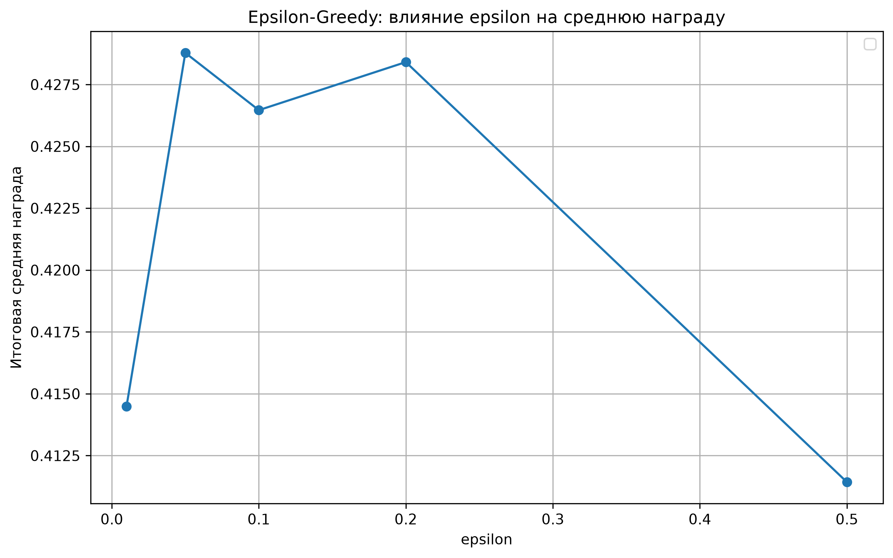
#### Рисунок 2 - Зависимость итоговой средней награды от параметра ε

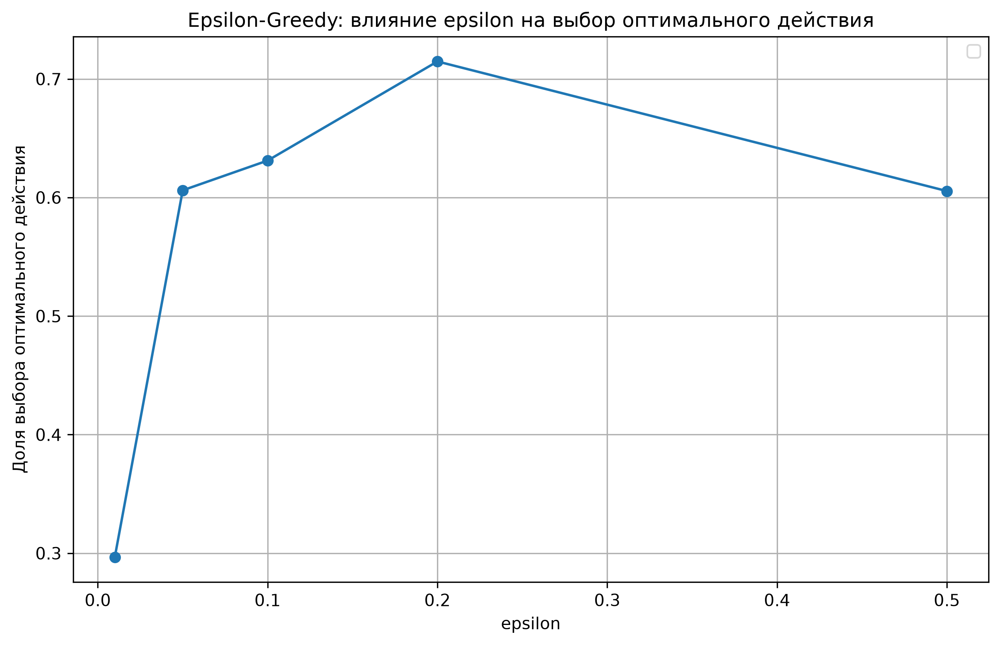
#### Рисунок 3 - Зависимость доли выбора оптимального действия от параметра ε

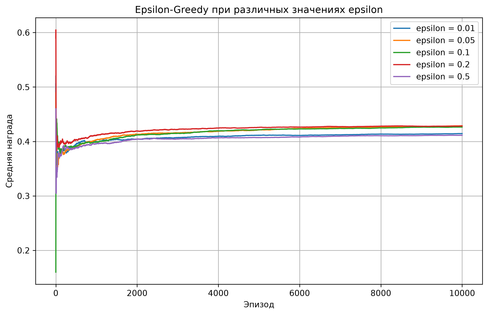
#### Рисунок 4 - Изменение средней награды при различных значениях $\varepsilon$

При $\varepsilon=0.01$ вероятность случайного исследования является очень низкой. 
Алгоритм почти всегда использует действие с максимальной текущей оценкой. 
В результате средняя награда составила 0.4145, однако доля выбора оптимального действия оказалась сравнительно низкой - 29.65%. 
Это показывает, что недостаточное исследование может привести к закреплению за неоптимальным действием.

При увеличении параметра до $\varepsilon=0.05$ средняя награда увеличилась до 0.4288, а доля выбора оптимального действия - до 60.61%.
Увеличение количества исследовательских действий позволяет алгоритму получить больше информации о доступных рычагах и снизить вероятность длительного выбора неоптимального действия.

При $\varepsilon=0.1$ средняя награда составила 0.4265, а доля выбора оптимального действия достигла 63.12%. 
По сравнению со значением $\varepsilon=0.05$ доля оптимального действия увеличилась, однако средняя награда немного снизилась. 
Это связано с тем, что увеличение количества исследований не обязательно приводит к увеличению непосредственно получаемой награды: часть действий продолжает выбираться случайно.

При $\varepsilon=0.2$ была получена максимальная среди исследованных значений доля выбора оптимального действия - 71.48%. 
Средняя награда составила 0.4284, то есть практически совпала с результатом при $\varepsilon=0.05$.

При дальнейшем увеличении параметра до $\varepsilon=0.5$ средняя награда снизилась до 0.4114. 
Несмотря на относительно высокую долю выбора оптимального действия (60.54%), половина действий в среднем выбирается случайным образом.
Поэтому значительная часть эпизодов приходится на неоптимальные действия, что приводит к снижению средней награды.

Таким образом, результаты демонстрируют наличие компромисса между исследованием и использованием найденной информации.
При слишком малом значении $\varepsilon$ алгоритм недостаточно исследует доступные действия, а при слишком большом значении значительная часть шагов расходуется на случайное исследование.

При этом две рассматриваемые метрики показывают несколько разные зависимости.
Максимальная средняя награда в проведённом эксперименте получена при $\varepsilon=0.05$ и составила 0.4288, тогда как максимальная доля выбора оптимального действия наблюдалась при $\varepsilon=0.2$ и составила 71.48%. Это объясняется тем, что доля выбора оптимального действия и непосредственно получаемая награда характеризуют разные стороны поведения алгоритма.

Для последующего эксперимента с различным количеством рычагов в качестве фиксированного значения параметра используется:

$$ \boxed{\varepsilon=0.2} $$

поскольку именно при этом значении в проведённом исследовании была получена приблизительно максимальная средняя награда при наибольшей вероятности выбора оптимального решения. При этом данный выбор относится к рассматриваемой среде и исследованному диапазону параметров и не является универсальным оптимальным значением для алгоритма Epsilon-Greedy.

### Исследование влияния параметра c

Для исследования влияния параметра $c$ был проведён ряд экспериментов с алгоритмом Upper Confidence Bound (UCB).
В каждом эксперименте использовалось 10 000 эпизодов и 100 независимых запусков. Конфигурация среды оставалась неизменной, изменялось только значение параметра $c$.

Исследовались следующие значения:

$$ c \in \{0.1,\;0.5,\;1.0,\;2.0,\;5.0\}. $$

Параметр $c$ определяет вклад исследовательской составляющей в критерий выбора действия. 
Чем больше его значение, тем большее значение алгоритм придаёт действиям, которые недостаточно часто исследовались.

#### Таблица 3 - Результаты исследования влияния параметра c
| $c$ | Средняя награда | Доля выбора оптимального действия |
|----:| --------------: | --------------------------------: |
| 0.1 |          0.3722 |                            0.3097 |
| 0.5 |          0.4332 |                            0.7224 |
| 1.0 |      **0.4368** |                        **0.8302** |
| 2.0 |          0.4272 |                            0.6771 |
| 5.0 |          0.4060 |                            0.5029 |

Для визуального анализа результатов были построены три графика.

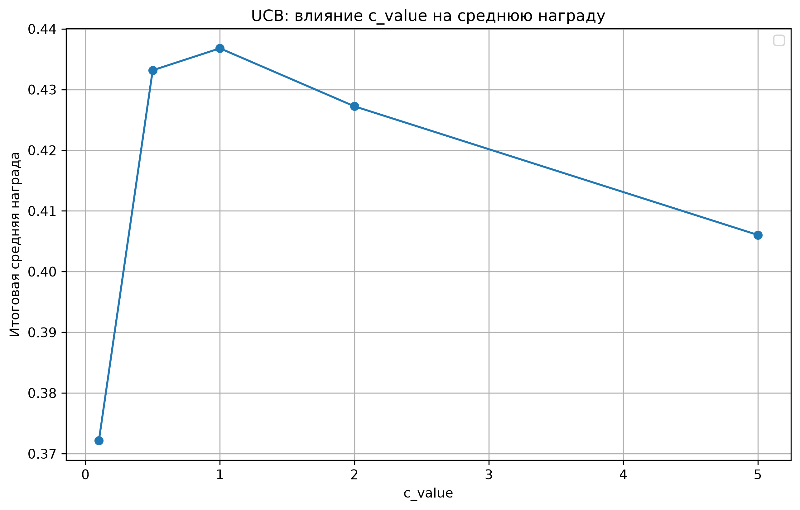
#### Рисунок 5 - Зависимость итоговой средней награды от параметра $c$

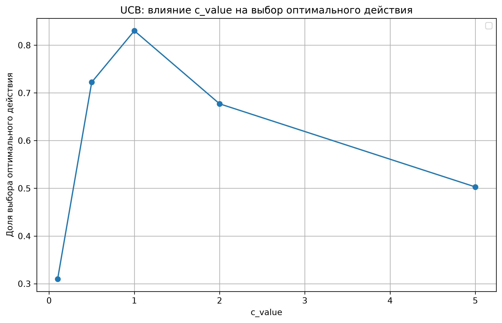
#### Рисунок 6 - Зависимость доли выбора оптимального действия от параметра c

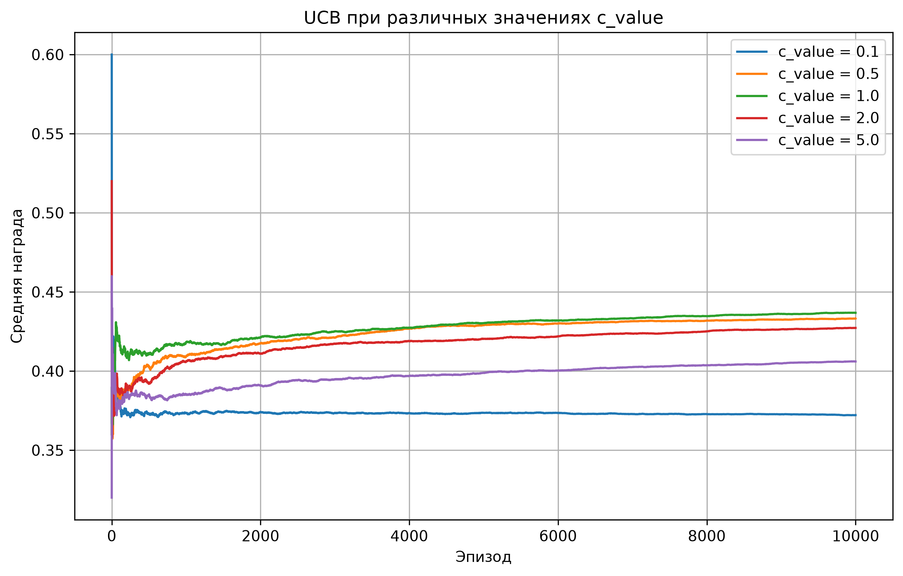
#### Рисунок 7 - Изменение средней награды при различных значениях параметра c

При малом значении $c=0.1$ влияние исследовательской составляющей в критерии UCB является незначительным. 
В результате алгоритм недостаточно активно исследует действия с высокой неопределённостью. 
Средняя награда в данном случае составила 0.3722, а доля выбора оптимального действия - 30.97%. 
Полученные значения существенно ниже результатов при более высоких значениях параметра.

При увеличении параметра до $c=0.5$ наблюдается существенное улучшение результатов. 
Средняя награда возрастает до 0.4332, а доля выбора оптимального действия - до 72.24%.
Это показывает, что увеличение интенсивности исследования позволяет алгоритму эффективнее определить наиболее перспективный рычаг.

При $c=1.0$ получены максимальные значения обеих рассматриваемых метрик среди исследованных вариантов. 
Средняя награда составила 0.4368, а доля выбора оптимального действия - 83.02%. 
Следовательно, в условиях рассматриваемой среды данное значение параметра обеспечивает эффективный баланс между исследованием и использованием уже полученной информации.

Дальнейшее увеличение параметра до $c=2.0$ приводит к снижению средней награды до 0.4272 и доли выбора оптимального действия до 67.71%.
Это связано с увеличением количества действий, выбираемых преимущественно из-за высокой неопределённости их оценок.

При $c=5.0$ эффект становится ещё более выраженным. 
Средняя награда снижается до 0.4060, а оптимальное действие выбирается в 50.29% случаев. 
Таким образом, чрезмерно высокая интенсивность исследования приводит к тому, что алгоритм продолжает уделять значительное внимание неоптимальным действиям даже после накопления достаточного количества информации об их качестве.

Полученные результаты демонстрируют нелинейную зависимость эффективности UCB от параметра $c$.
При увеличении $c$ от 0.1 до 1.0 эффективность возрастает, поскольку усиливается исследование недостаточно изученных действий.
Однако дальнейшее увеличение параметра приводит к обратному эффекту из-за чрезмерного исследования.

В рассматриваемой конфигурации среды наилучшие результаты среди исследованных значений параметра получены при:

$$ \boxed{c=1.0} $$

При этом средняя награда составила 0.4368, а доля выбора оптимального действия - 83.02%.

Следовательно, для последующего эксперимента по изменению количества рычагов используется именно это значение.

### Исследование влияния параметра $\alpha$

Для исследования влияния параметра $\alpha$ был проведён ряд экспериментов с алгоритмом Gradient.
В каждом эксперименте использовалось 10 000 эпизодов и 100 независимых запусков.
Конфигурация среды оставалась неизменной, изменялось только значение параметра скорости обучения $\alpha$.

Исследовались следующие значения:

$$ \alpha \in \{0.01,\;0.05,\;0.1,\;0.5,\;1.0\}. $$

Параметр $\alpha$ определяет интенсивность изменения предпочтений действий после получения очередной награды.
Малые значения приводят к более плавному изменению предпочтений, тогда как большие значения позволяют алгоритму быстрее реагировать на новые наблюдения, но одновременно делают его более чувствительным к случайным изменениям награды.

#### Таблица 4 - Результаты исследования влияния параметра $\alpha$
| $\alpha$ | Средняя награда | Доля выбора оптимального действия |
|---------:| --------------: | --------------------------------: |
|     0.01 |          0.4199 |                            0.6235 |
|     0.05 |          0.4357 |                        **0.8096** |
|     0.10 |      **0.4385** |                            0.7796 |
|     0.50 |          0.4215 |                            0.4888 |
|     1.00 |          0.4184 |                            0.5565 |

Для визуального анализа результатов были построены три графика.

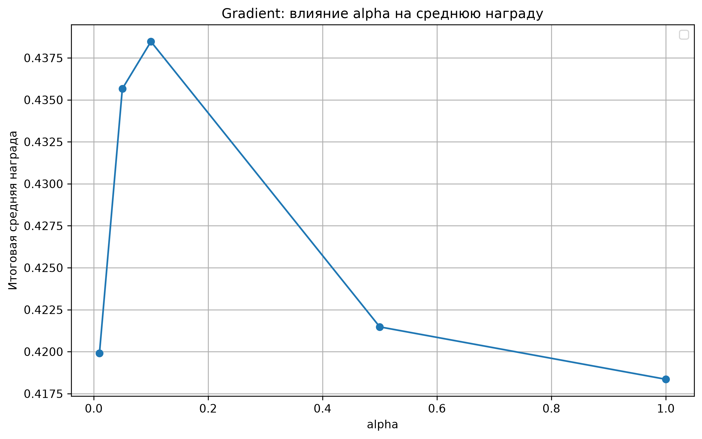
#### Рисунок 8 - Зависимость итоговой средней награды от параметра α

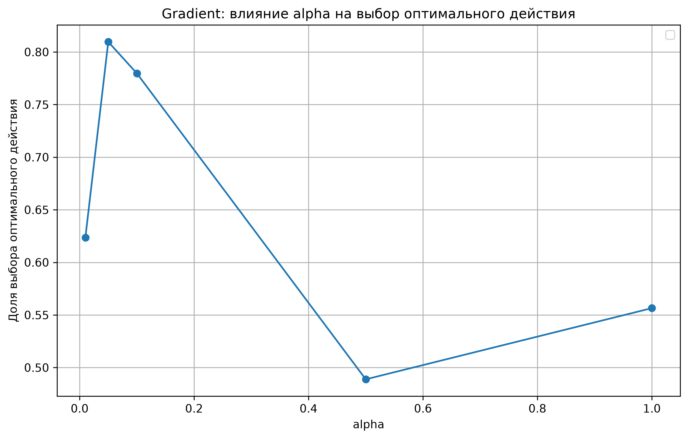
#### Рисунок 9 - Зависимость доли выбора оптимального действия от параметра α

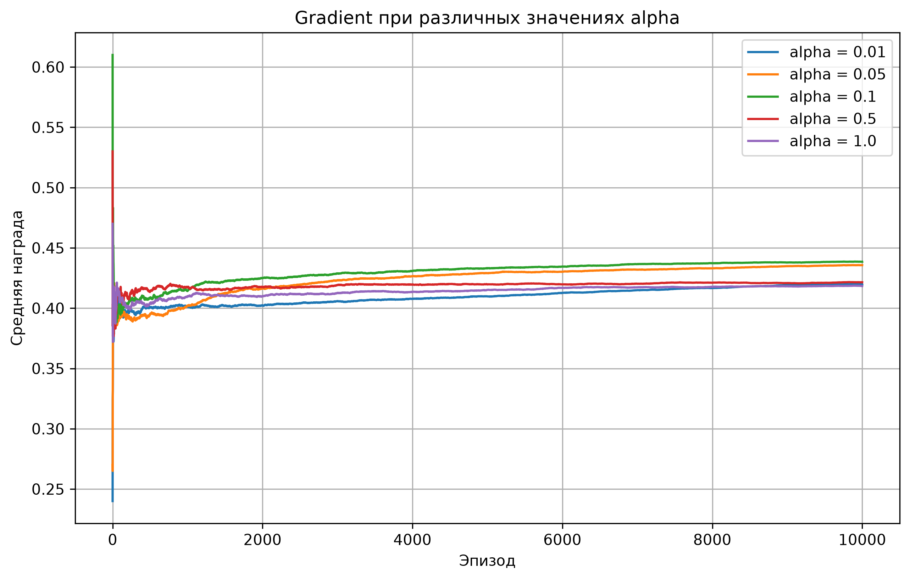
#### Рисунок 10 - Изменение средней награды при различных значениях параметра $\alpha$

При небольшом значении $\alpha=0.01$ предпочтения действий изменяются медленно. 
Средняя награда составила 0.4199, а доля выбора оптимального действия - 62.35%. 
Небольшая скорость обновления позволяет получать более плавное изменение предпочтений, однако одновременно замедляет адаптацию алгоритма к получаемой информации.

При увеличении параметра до $\alpha=0.05$ наблюдается существенное повышение эффективности. 
Средняя награда увеличилась до 0.4357, а доля выбора оптимального действия достигла 80.96%.
Это свидетельствует о том, что более быстрая корректировка предпочтений позволяет алгоритму эффективнее концентрировать вероятность выбора на перспективном действии.

При $\alpha=0.1$ была получена максимальная средняя награда среди исследованных значений - 0.4385.
Доля выбора оптимального действия при этом составила 77.96%. 
Таким образом, несмотря на несколько меньшую долю выбора оптимального действия по сравнению с $\alpha=0.05$, непосредственно получаемая средняя награда оказалась выше.

При дальнейшем увеличении параметра до $\alpha=0.5$ средняя награда снизилась до 0.4215, а доля выбора оптимального действия - до 48.88%.
При таком значении предпочтения изменяются значительно быстрее, поэтому отдельные случайные вознаграждения могут оказывать чрезмерное влияние на распределение вероятностей выбора.

При максимальном исследованном значении $\alpha=1.0$ средняя награда составила 0.4184, а доля выбора оптимального действия - 55.65%. 
Результат также ниже значений, полученных при $\alpha=0.05$ и $\alpha=0.1$, что подтверждает негативное влияние чрезмерно высокой скорости обновления в рассматриваемой среде.

Таким образом, зависимость эффективности Gradient от $\alpha$ имеет выраженный нелинейный характер.
При увеличении параметра от малых значений эффективность сначала повышается благодаря более быстрой адаптации предпочтений, однако после некоторого значения начинает снижаться из-за повышенной чувствительности к случайным вознаграждениям.

В проведённом эксперименте максимальная средняя награда составила 0.4385 и была получена при $\alpha=0.1$

Максимальная доля выбора оптимального действия наблюдалась при $\alpha=0.05$ и составила 80.96%.

Поскольку основной метрикой исследования является средняя награда, для дальнейшего эксперимента с различным количеством рычагов используется:

$$ \boxed{\alpha=0.1} $$

Таким образом, результаты исследования параметров позволяют зафиксировать следующие значения для последующего сравнения алгоритмов при изменении количества действий:

$$ \boxed{ \varepsilon=0.05,\qquad c=1.0,\qquad \alpha=0.1 } $$

Эти значения получены экспериментально для рассматриваемой конфигурации среды и используются далее без дополнительной настройки при изменении количества рычагов.

### Исследование влияния количества рычагов

Для исследования влияния размера пространства действий были проведены эксперименты с различным количеством доступных рычагов: 3, 5, 10 и 20.

При увеличении количества рычагов исходные три действия сохранялись, включая оптимальный рычаг с ожидаемой наградой $0.45$. 
Дополнительные рычаги имели ожидаемые награды ниже $0.45$, поэтому оптимальное действие сохранялось неизменным. 
Таким образом, изменение количества рычагов позволяло исследовать влияние увеличения пространства действий без изменения максимальной ожидаемой награды среды.

Для всех вариантов использовались одинаковые параметры алгоритмов:

$$ \varepsilon=0.05,\qquad c=1.0,\qquad \alpha=0.1. $$

Каждый эксперимент проводился в течение 10 000 эпизодов и 100 независимых запусков.

#### Таблица 5 - Результаты при различном количестве рычагов
| Количество рычагов | Алгоритм       | Средняя награда | Доля выбора оптимального действия |   Цвет |
| -----------------: |----------------| --------------: | --------------------------------: |-------:|
|                  3 | Greedy         |          0.3803 |                            0.1100 | <div style="background-color: #0000FF; padding: 5px;"></div> |
|                  3 | Epsilon-Greedy |          0.4111 |                            0.6054 | <div style="background-color: #FFA500 ; padding: 5px;"></div> |
|                  3 | UCB            |      **0.4356** |                        **0.8343** | <div style="background-color: #008000; padding: 5px;"></div> |
|                  3 | Gradient       |          0.4336 |                            0.7392 | <div style="background-color: #FF0000; padding: 5px;"></div> |
|                  5 | Greedy         |          0.3427 |                            0.1499 | <div style="background-color: #0000FF; padding: 5px;"></div> |
|                  5 | Epsilon-Greedy |          0.3824 |                            0.5382 | <div style="background-color: #FFA500 ; padding: 5px;"></div> |
|                  5 | UCB            |          0.4317 |                        **0.8039** | <div style="background-color: #008000; padding: 5px;"></div> |
|                  5 | Gradient       |      **0.4319** |                            0.7572 | <div style="background-color: #FF0000; padding: 5px;"></div> |
|                 10 | Greedy         |          0.2934 |                            0.1288 | <div style="background-color: #0000FF; padding: 5px;"></div> |
|                 10 | Epsilon-Greedy |          0.3471 |                            0.4587 | <div style="background-color: #FFA500 ; padding: 5px;"></div> |
|                 10 | UCB            |          0.4180 |                        **0.7478** | <div style="background-color: #008000; padding: 5px;"></div> |
|                 10 | Gradient       |      **0.4248** |                            0.7120 | <div style="background-color: #FF0000; padding: 5px;"></div> |
|                 20 | Greedy         |          0.2737 |                            0.0896 | <div style="background-color: #0000FF; padding: 5px;"></div> |
|                 20 | Epsilon-Greedy |          0.3217 |                            0.3410 | <div style="background-color: #FFA500 ; padding: 5px;"></div> |
|                 20 | UCB            |          0.3918 |                        **0.6556** | <div style="background-color: #008000; padding: 5px;"></div> |
|                 20 | Gradient       |      **0.4033** |                            0.5594 | <div style="background-color: #FF0000; padding: 5px;"></div> |

Для наглядного сравнения были построены два графика.

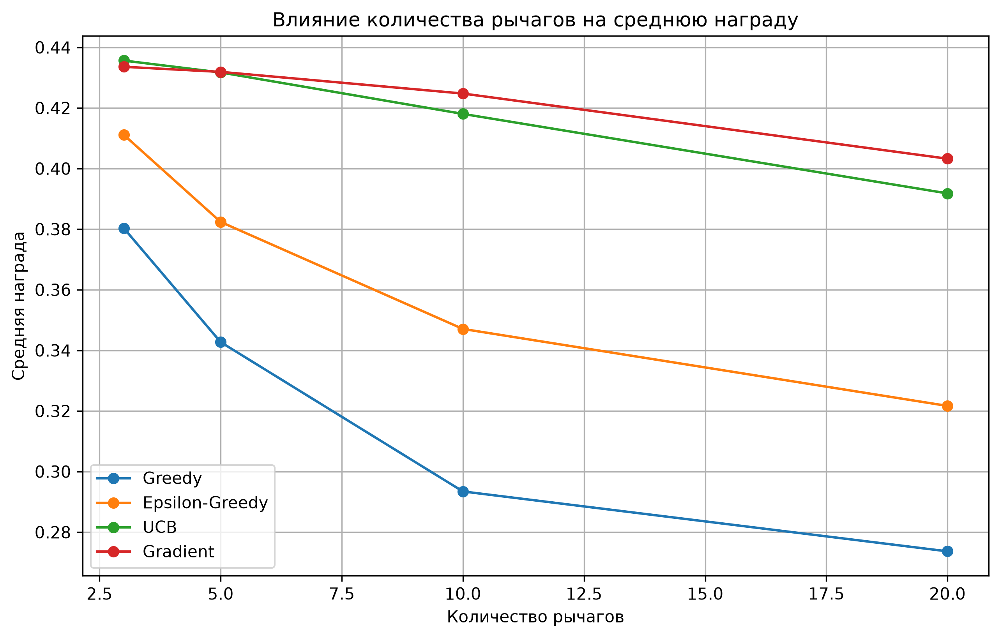
#### Рисунок 11 - Зависимость средней награды от количества рычагов

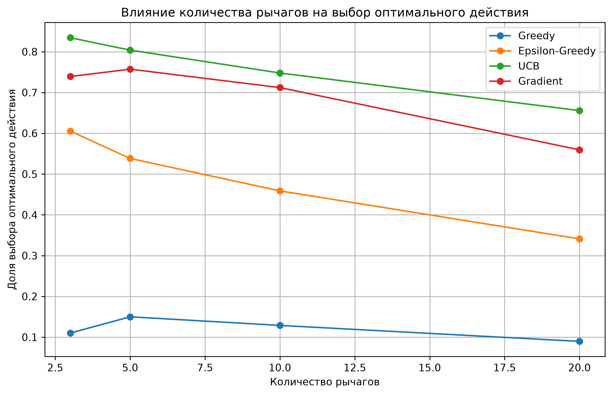
#### Рисунок 12 - Зависимость доли выбора оптимального действия от количества рычагов

Полученные результаты показывают, что увеличение количества доступных действий приводит к снижению средней награды для всех исследуемых алгоритмов.
Это связано с увеличением пространства поиска: алгоритму требуется исследовать большее количество вариантов, прежде чем он сможет достаточно точно оценить качество каждого действия.

Наиболее заметное снижение наблюдается у жадной стратегии. 
При трёх рычагах средняя награда составила 0.3803, а при увеличении их количества до 20 снизилась до 0.2737. 
Доля выбора оптимального действия при этом изменилась с 11.00% до 8.96%. 
Низкие значения показателя объясняются отсутствием механизма целенаправленного исследования: увеличение числа действий повышает вероятность того, что алгоритм будет длительное время использовать неоптимальное действие.

Для Epsilon-Greedy средняя награда снизилась с 0.4111 при трёх рычагах до 0.3217 при двадцати. 
Доля выбора оптимального действия уменьшилась с 60.54% до 34.10%. 
В отличие от жадной стратегии, Epsilon-Greedy сохраняет механизм случайного исследования, поэтому увеличение пространства действий компенсируется частично. 
Однако фиксированное значение $\varepsilon=0.05$ означает, что интенсивность исследования не изменяется вместе с количеством доступных действий.

UCB продемонстрировал более высокую устойчивость к увеличению количества рычагов.
Средняя награда изменилась с 0.4356 при трёх рычагах до 0.3918 при двадцати.
Доля выбора оптимального действия при этом составила соответственно 83.43% и 65.56%. 
Снижение эффективности при увеличении пространства действий наблюдается, однако оно происходит постепенно.
Это соответствует принципу работы UCB, поскольку алгоритм учитывает не только полученную оценку награды, но и степень недостаточной изученности действия.

Для Gradient средняя награда уменьшилась с 0.4336 до 0.4033, то есть снижение также оказалось относительно плавным. 
Доля выбора оптимального действия уменьшилась с 73.92% до 55.94%. 
При этом Gradient сохранял достаточно высокую среднюю награду даже при 20 доступных действиях.

Особенно заметно различие между алгоритмами при максимальном количестве рычагов. 
При 20 рычагах средняя награда составила:

$$ 0.2737 \quad \text{для Greedy}, $$ $$ 0.3217 \quad \text{для Epsilon-Greedy}, $$ $$ 0.3918 \quad \text{для UCB}, $$ $$ 0.4033 \quad \text{для Gradient}. $$

Таким образом, увеличение количества действий оказывает наибольшее влияние на стратегии, которые менее эффективно управляют исследованием пространства действий.
Алгоритмы UCB и Gradient при увеличении количества рычагов также теряют часть эффективности, однако сохраняют более высокие значения средней награды.

Следует учитывать, что в данном эксперименте параметры алгоритмов оставались фиксированными:

$$ \varepsilon=0.05,\qquad c=1.0,\qquad \alpha=0.1. $$

Поэтому полученные результаты характеризуют влияние именно изменения количества действий при неизменных параметрах алгоритмов.
Дополнительная настройка параметров для каждого количества рычагов могла бы привести к другим результатам, но в таком случае одновременно исследовались бы два фактора.

Полученные результаты подтверждают важность механизма исследования в задаче многорукого бандита. 
Чем больше доступных действий необходимо исследовать, тем существеннее становится способность алгоритма эффективно распределять выборы между уже изученными и недостаточно изученными действиями.

### Обобщение результатов экспериментов

| Алгоритм       | Основная особенность                                  | Поведение в экспериментах                                |
|----------------|-------------------------------------------------------|----------------------------------------------------------|
| Greedy         | Нет исследования                                      | Сильно зависит от начальных случайных наблюдений         |
| Epsilon-Greedy | Случайное исследование с вероятностью $\varepsilon$   | Сильно зависит от выбора $\varepsilon$                   |
| UCB            | Исследование через доверительный интервал             | Сохраняет высокую эффективность при росте числа действий |
| Gradient       | Обновление предпочтений и Softmax                     | Хорошо адаптируется, но чувствителен к $\alpha$          |

Проведённые эксперименты показали, что эффективность алгоритмов многорукого бандита существенно зависит как от используемой стратегии выбора действий, так и от параметров алгоритма. 
Отсутствие механизма исследования у жадной стратегии приводит к высокой зависимости от случайных начальных наблюдений. 
В Epsilon-Greedy существенное влияние оказывает параметр $\varepsilon$, определяющий интенсивность исследования.
Для UCB аналогичную роль играет параметр $c$, регулирующий величину бонуса за исследование. 
В Gradient эффективность зависит от скорости обновления предпочтений, определяемой параметром $\alpha$. 
Увеличение количества доступных действий приводит к снижению средней награды всех исследованных алгоритмов, поскольку возрастает объём пространства, которое необходимо исследовать.

## Заключение

В ходе лабораторной работы была исследована задача о многоруком бандите и проведено сравнение нескольких стратегий выбора действий: Greedy, Epsilon-Greedy, UCB и Gradient.

В рамках работы была реализована программная среда, моделирующая набор рычагов с различными вероятностями получения вознаграждения и размерами награды. 
Для оценки работы алгоритмов использовались две основные метрики: средняя накопленная награда и доля выбора оптимального действия.

В ходе экспериментов было установлено, что жадная стратегия без механизма исследования может длительное время выбирать неоптимальное действие из-за случайных начальных наблюдений. 
Добавление исследования в Epsilon-Greedy позволяет повысить эффективность, однако результат существенно зависит от выбранного значения $\varepsilon$.

Для алгоритма UCB было исследовано влияние параметра $c$. 
В рассматриваемой конфигурации среды значение $c=1.0$ обеспечило среднюю награду 0.4368 и долю выбора оптимального действия 83.02%.
Слишком малые значения параметра приводили к недостаточному исследованию, а чрезмерно большие - к избыточному исследованию уже известных действий.

Для Gradient было исследовано влияние параметра $\alpha$. 
Максимальная средняя награда среди рассмотренных значений была получена при $\alpha=0.1$ и составила 0.4385. 
При увеличении $\alpha$ до больших значений эффективность снижалась, что связано с более сильной реакцией предпочтений на отдельные случайные вознаграждения.

Также было исследовано влияние количества доступных действий. 
При увеличении количества рычагов с 3 до 20 средняя награда снизилась для всех алгоритмов. 
Например, для Gradient она уменьшилась с 0.4336 до 0.4033, а для UCB - с 0.4356 до 0.3918.
Это показывает, что увеличение пространства действий усложняет процесс поиска перспективного действия и требует от алгоритмов эффективного управления исследованием.

Таким образом, проведённое исследование показало важность баланса между исследованием новых действий и использованием уже полученной информации.
Результаты экспериментов также подтвердили, что параметры алгоритмов существенно влияют на их поведение, а увеличение количества доступных действий усложняет задачу обучения.

В результате выполнения лабораторной работы были закреплены практические навыки реализации и экспериментального сравнения алгоритмов многорукого бандита, анализа их параметров и интерпретации полученных результатов.

---

<details>
<summary>ЛОГИ ЭКСПЕРИМЕНТОВ</summary>

```bash
2026-09-22 20:52:48,800 | INFO | Запуск Greedy: базовый параметр = None
2026-09-22 20:53:07,112 | INFO | Запуск Epsilon-Greedy: базовый параметр = 0.5 
2026-09-22 20:53:25,473 | INFO | Запуск UCB: базовый параметр = 1.0
2026-09-22 20:55:11,007 | INFO | Запуск Gradient: базовый параметр = 0.1
2026-09-22 20:57:29,175 | INFO | Greedy: reward = 0.3817, optimal = 0.1300
2026-09-22 20:57:29,175 | INFO | Epsilon-Greedy: reward = 0.4114, optimal = 0.5869
2026-09-22 20:57:29,175 | INFO | UCB: reward = 0.4369, optimal = 0.8288
2026-09-22 20:57:29,175 | INFO | Gradient: reward = 0.4379, optimal = 0.8218
2026-09-22 20:57:47,701 | INFO | Запуск Epsilon-Greedy: epsilon = 0.01
2026-09-22 20:58:09,401 | INFO | Запуск Epsilon-Greedy: epsilon = 0.05
2026-09-22 20:58:30,495 | INFO | Запуск Epsilon-Greedy: epsilon = 0.1
2026-09-22 20:58:51,369 | INFO | Запуск Epsilon-Greedy: epsilon = 0.2
2026-09-22 20:59:11,807 | INFO | Запуск Epsilon-Greedy: epsilon = 0.5
2026-09-22 20:59:30,215 | INFO | epsilon = 0.01: reward = 0.4145, optimal = 0.2965
2026-09-22 20:59:30,215 | INFO | epsilon = 0.05: reward = 0.4288, optimal = 0.6061
2026-09-22 20:59:30,216 | INFO | epsilon = 0.1: reward = 0.4265, optimal = 0.6312
2026-09-22 20:59:30,216 | INFO | epsilon = 0.2: reward = 0.4284, optimal = 0.7148
2026-09-22 20:59:30,216 | INFO | epsilon = 0.5: reward = 0.4114, optimal = 0.6054
2026-09-22 20:59:55,728 | INFO | Запуск UCB: c_value = 0.1
2026-09-22 21:01:45,439 | INFO | Запуск UCB: c_value = 0.5
2026-09-22 21:03:33,469 | INFO | Запуск UCB: c_value = 1.0
2026-09-22 21:05:30,295 | INFO | Запуск UCB: c_value = 2.0
2026-09-22 21:07:18,390 | INFO | Запуск UCB: c_value = 5.0
2026-09-22 21:09:04,644 | INFO | c = 0.1: reward = 0.3722, optimal = 0.3097
2026-09-22 21:09:04,644 | INFO | c = 0.5: reward = 0.4332, optimal = 0.7224
2026-09-22 21:09:04,644 | INFO | c = 1.0: reward = 0.4368, optimal = 0.8302
2026-09-22 21:09:04,644 | INFO | c = 2.0: reward = 0.4272, optimal = 0.6771
2026-09-22 21:09:04,644 | INFO | c = 5.0: reward = 0.4060, optimal = 0.5029
2026-09-22 21:09:17,832 | INFO | Запуск Gradient: alpha = 0.01
2026-09-22 21:11:36,359 | INFO | Запуск Gradient: alpha = 0.05
2026-09-22 21:13:55,547 | INFO | Запуск Gradient: alpha = 0.1
2026-09-22 21:16:14,720 | INFO | Запуск Gradient: alpha = 0.5
2026-09-22 21:18:33,480 | INFO | Запуск Gradient: alpha = 1.0
2026-09-22 21:20:52,450 | INFO | alpha = 0.01: reward = 0.4199, optimal = 0.6235
2026-09-22 21:20:52,450 | INFO | alpha = 0.05: reward = 0.4357, optimal = 0.8096
2026-09-22 21:20:52,450 | INFO | alpha = 0.1: reward = 0.4385, optimal = 0.7796
2026-09-22 21:20:52,450 | INFO | alpha = 0.5: reward = 0.4215, optimal = 0.4888
2026-09-22 21:20:52,451 | INFO | alpha = 1.0: reward = 0.4184, optimal = 0.5565
2026-09-22 21:21:05,688 | INFO | Количество рычагов: 3
2026-09-22 21:21:05,688 | INFO | Запуск: Greedy
2026-09-22 21:21:24,126 | INFO | Запуск: Epsilon-Greedy
2026-09-22 21:21:42,649 | INFO | Запуск: UCB
2026-09-22 21:23:28,938 | INFO | Запуск: Gradient
2026-09-22 21:25:48,623 | INFO | Количество рычагов: 5
2026-09-22 21:25:48,623 | INFO | Запуск: Greedy
2026-09-22 21:26:07,340 | INFO | Запуск: Epsilon-Greedy
2026-09-22 21:26:26,043 | INFO | Запуск: UCB
2026-09-22 21:29:06,193 | INFO | Запуск: Gradient
2026-09-22 21:32:04,852 | INFO | Количество рычагов: 10
2026-09-22 21:32:04,852 | INFO | Запуск: Greedy
2026-09-22 21:32:24,259 | INFO | Запуск: Epsilon-Greedy
2026-09-22 21:32:43,281 | INFO | Запуск: UCB
2026-09-22 21:37:36,742 | INFO | Запуск: Gradient
2026-09-22 21:42:11,844 | INFO | Количество рычагов: 20
2026-09-22 21:42:11,845 | INFO | Запуск: Greedy
2026-09-22 21:42:32,782 | INFO | Запуск: Epsilon-Greedy
2026-09-22 21:42:52,428 | INFO | Запуск: UCB
2026-09-22 21:52:10,618 | INFO | Запуск: Gradient
2026-09-22 21:59:56,890 | INFO | 3 рычагов
2026-09-22 21:59:56,890 | INFO | Greedy: reward = 0.3803, optimal = 0.1100
2026-09-22 21:59:56,890 | INFO | Epsilon-Greedy: reward = 0.4111, optimal = 0.6054
2026-09-22 21:59:56,890 | INFO | UCB: reward = 0.4356, optimal = 0.8343
2026-09-22 21:59:56,890 | INFO | Gradient: reward = 0.4336, optimal = 0.7392
2026-09-22 21:59:56,890 | INFO | 5 рычагов
2026-09-22 21:59:56,890 | INFO | Greedy: reward = 0.3427, optimal = 0.1499
2026-09-22 21:59:56,890 | INFO | Epsilon-Greedy: reward = 0.3824, optimal = 0.5382
2026-09-22 21:59:56,890 | INFO | UCB: reward = 0.4317, optimal = 0.8039
2026-09-22 21:59:56,890 | INFO | Gradient: reward = 0.4319, optimal = 0.7572
2026-09-22 21:59:56,890 | INFO | 10 рычагов
2026-09-22 21:59:56,890 | INFO | Greedy: reward = 0.2934, optimal = 0.1288
2026-09-22 21:59:56,890 | INFO | Epsilon-Greedy: reward = 0.3471, optimal = 0.4587
2026-09-22 21:59:56,890 | INFO | UCB: reward = 0.4180, optimal = 0.7478
2026-09-22 21:59:56,890 | INFO | Gradient: reward = 0.4248, optimal = 0.7120
2026-09-22 21:59:56,890 | INFO | 20 рычагов
2026-09-22 21:59:56,890 | INFO | Greedy: reward = 0.2737, optimal = 0.0896
2026-09-22 21:59:56,890 | INFO | Epsilon-Greedy: reward = 0.3217, optimal = 0.3410
2026-09-22 21:59:56,890 | INFO | UCB: reward = 0.3918, optimal = 0.6556
2026-09-22 21:59:56,890 | INFO | Gradient: reward = 0.4033, optimal = 0.5594
```
</details>
